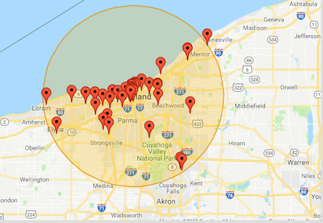

# "Brew Finder" Beer App Project Proposal

## Project 3: Bryce Basista, Nancy Dziak, Talemanie Borsay

The purpose of this project is to provide beer enthusiasts with an app that will interactively allow the end user to locate local breweries as well as interact with the app in order to learn interesting things about beer.  

We chose a craft beer dataset that we found on Kaggle.com.  The dataset includes beer and brewery data, both is CSV format.  The beer dataset includes the name and style of the beer as well as a unique ID for the beer.  It also includes information about the beer’s ABV (alcohol by volume), as well as its IBU (international bitterness unit) or how bitter the beer is.  The brewery dataset includes the name of the brewery as well as it’s city and state.

<https://www.kaggle.com/nickhould/craft-cans#beers.csv>.

For our project we will also use brewerydb.com.  This website includes a free sandbox API that we will use to collect data pertaining to beer and breweries in Ohio in order to compensate for limitations in the kaggle.com dataset.  

<https://brewerydb.com/>.

### Visual #1
 

### Visual #2
 

### Other Visuals
Other Visuals that may be used are plot, bar, and line charts of relevant brewery and beer data. A master table may also be created to display a brewery and beer directory. 

Primary GitHub repository - <https://github.com/bbasista87/Project-2-Brewery-App.git>.
